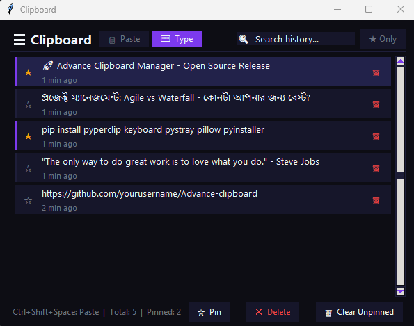

# Advance Clipboard Manager

[](LICENSE)
[](https://python.org)
[](https://windows.com)

A modern, feature-rich clipboard manager for Windows built with Python and Tkinter. Monitor clipboard history, search through copied items, pin favorites, and paste with ease.



## Features

- **Clipboard Monitoring** - Automatically captures everything you copy
- **Search History** - Find any copied item instantly
- **Pin Items** - Keep important clips accessible
- **Paste & Type Modes** - Paste directly or type text character by character
- **System Tray** - Runs quietly in the background
- **Global Hotkey** - `Ctrl+Shift+Space` to paste from anywhere
- **Dark Theme** - Easy on the eyes
- **Portable EXE** - No Python installation needed (build your own or download a release)

## Installation

### Option 1: Run from source

```bash
# Clone the repository
git clone https://github.com/yourusername/Advance-clipboard.git
cd Advance-clipboard

# Install dependencies
pip install -r requirements.txt

# Run the app
python main.py
```

### Option 2: Build standalone EXE

```bash
# Run the build script
.\scripts\build.bat

# Or use PyInstaller directly
pyinstaller clipboard-manager.spec
```

The executable will be created in the `dist/` folder.

## Usage

| Action | Description |
|---|---|
| Launch app | Double-click executable or run `python main.py` |
| Paste item | Click the **▶** button or double-click a card |
| Type item | Click the **⌨** button |
| Pin item | Click the **☆** star icon |
| Delete item | Click the **×** button |
| Search history | Type in the search box or press `Ctrl+F` |
| Filter pinned | Click **★ Only** button |
| Global hotkey | `Ctrl+Shift+Space` to paste selected item |
| Minimize to tray | Close window or press `Escape` |

## Keyboard Shortcuts

| Shortcut | Action |
|---|---|
| `Ctrl+Shift+Space` | Paste selected item (global) |
| `Ctrl+F` | Focus search box |
| `Escape` | Minimize to tray |

## Tech Stack

- **Python 3.8+**
- **Tkinter** (GUI)
- **PyInstaller** (EXE packaging)
- **keyboard** (global hotkeys)
- **pyperclip** (clipboard access)
- **pystray** (system tray icon)
- **Pillow** (tray icon rendering)

## Project Structure

```
Advance-clipboard/
├── assets/              # Images, icons, screenshots
├── scripts/             # Build and utility scripts
├── src/                 # Source code
│   ├── main.py          # Application entry point
│   ├── storage.py       # JSON-based data persistence
│   ├── monitor.py       # Clipboard background monitor
│   └── paster.py        # Paste and type utilities
├── main.py              # Root launcher
├── requirements.txt     # Python dependencies
├── clipboard-manager.spec  # PyInstaller spec
├── LICENSE              # MIT License
└── README.md            # This file
```

## Contributing

Contributions are welcome! Please read [CONTRIBUTING.md](CONTRIBUTING.md) for guidelines.

## License

This project is licensed under the MIT License - see the [LICENSE](LICENSE) file for details.
